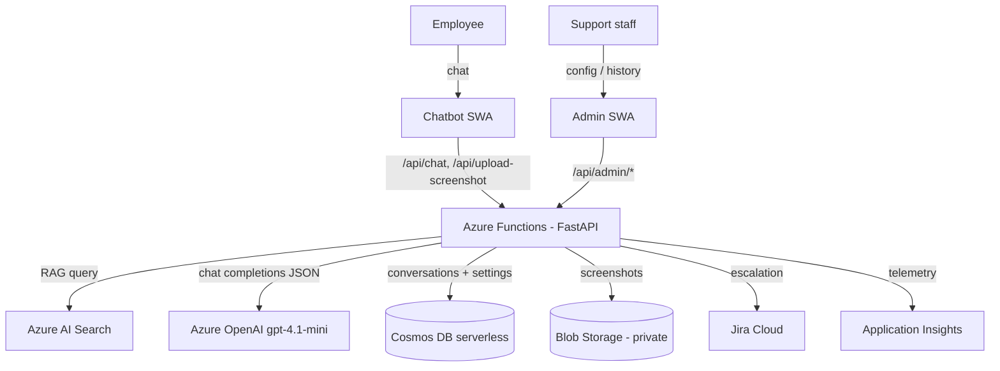

# IT Support Assistant

An AI-powered IT support chatbot for employees, with a RAG knowledge base, depth-aware
troubleshooting, automatic escalation to Jira, and an admin backoffice for configuration
and conversation review.

## Overview

Employees describe an IT problem in a chat UI. The assistant answers using **only** a
curated knowledge base (retrieval-augmented generation over Azure AI Search), asks
clarifying follow-up questions when needed, and — when it can't resolve the issue within
a configurable troubleshooting budget — escalates by creating a **Jira ticket** that
includes the full transcript, the captured browser environment, a suggested priority, and
an uploaded screenshot. Conversations and runtime settings are stored in Cosmos DB. An
admin frontend lets support staff tune the assistant's behavior (system prompt,
troubleshooting depth, follow-up limit) and browse past conversations.

## Architecture

| Concern | Service |
| --- | --- |
| LLM (chat + JSON decisions) | **Azure OpenAI** — `gpt-4.1-mini` deployment (GlobalStandard) |
| Knowledge base retrieval | **Azure AI Search** (Free tier) |
| Conversations + config store | **Azure Cosmos DB** (serverless) |
| Screenshot storage | **Azure Blob Storage** (private `screenshots` container) |
| Backend API | **Azure Functions** (Linux consumption plan, Python 3.12, FastAPI via ASGI) |
| Chatbot + Admin UIs | **Azure Static Web Apps** (Free tier) ×2 |
| Monitoring | **Application Insights** |
| Ticketing | **Jira Cloud** REST API |



The backend is a single FastAPI app (`backend/app/main.py`). In production it runs on Azure
Functions: `backend/function_app.py` mounts the FastAPI app under `/api` and proxies every
HTTP method to it via `AsgiMiddleware`. The two frontends are static React/Vite bundles that
call the backend over HTTPS.

### Live URLs

- Chatbot: https://jolly-ground-0cab7bc0f.7.azurestaticapps.net
- Admin: https://white-rock-076e13c0f.7.azurestaticapps.net
- Backend API base: https://it-support-api.azurewebsites.net/api  (e.g. `/api/health`)

## Repository layout

```
backend/            FastAPI app + Azure Functions wrapper
  app/main.py       API routes (/health, /chat, /upload-screenshot, /admin/*)
  rag.py            Azure AI Search retrieval
  llm.py            Azure OpenAI client + agent decision (JSON mode)
  prompts.py        DEPTH_INSTRUCTIONS + build_system_prompt
  db.py             Cosmos DB client, containers, settings seed
  storage.py        Blob upload/download (screenshots)
  jira_client.py    Jira ticket creation + screenshot attachment
  models.py         Pydantic models (AgentDecision, EnvironmentInfo)
  function_app.py   Azure Functions entrypoint (ASGI wrapper, mounts app under /api)
  host.json         Functions host config (routePrefix "api")
chatbot-frontend/   Employee chat UI (React + TS + Vite)
admin-frontend/     Admin backoffice UI (React + TS + Vite)
docs/               Knowledge base source articles (indexed into Azure AI Search)
```

## Running locally

### Backend

```bash
cd backend
python -m venv .venv
.venv\Scripts\activate            # Windows  (source .venv/bin/activate on macOS/Linux)
pip install -r requirements.txt
cp .env.example .env               # then fill in the values below
uvicorn app.main:app --reload --port 8000
# health check: curl http://localhost:8000/health  ->  {"status":"ok"}
```

Required `backend/.env` variables:

```
AZURE_OPENAI_ENDPOINT      AZURE_OPENAI_KEY      AZURE_OPENAI_DEPLOYMENT
AZURE_SEARCH_ENDPOINT      AZURE_SEARCH_KEY      AZURE_SEARCH_INDEX
COSMOS_ENDPOINT            COSMOS_KEY            BLOB_CONNECTION_STRING
JIRA_BASE_URL   JIRA_EMAIL   JIRA_API_TOKEN   JIRA_PROJECT_KEY
# optional: ALLOWED_ORIGINS (comma-separated; defaults to "*" locally)
```

### Frontends

```bash
cd chatbot-frontend   # and again in admin-frontend
npm install
# .env: VITE_API_BASE_URL=http://localhost:8000   (local)
npm run dev
```

Each frontend reads `VITE_API_BASE_URL` from its `.env`. Locally that's
`http://localhost:8000`; in production it's `https://it-support-api.azurewebsites.net/api`.

## Deployment

- **Backend → Azure Functions** (Linux consumption, Python 3.12) via zip deploy with
  server-side (Oryx) build:
  ```bash
  az functionapp deployment source config-zip \
    -g it-support-rg -n it-support-api --src func_deploy.zip --build-remote true
  ```
  Configuration (the `.env` values and `APPLICATIONINSIGHTS_CONNECTION_STRING`) is set as
  Function App **application settings** — `.env` is never deployed. **CORS** is configured
  at the **platform level** (`az functionapp cors add`) rather than in app code, because the
  Functions host answers the CORS preflight (`OPTIONS`) itself before the request reaches
  the ASGI app; the allowed origins are the two Static Web App URLs.
- **Frontends → Azure Static Web Apps** via the SWA CLI using each app's deployment token:
  ```bash
  npx @azure/static-web-apps-cli deploy ./dist --deployment-token <token> --env production
  ```
  (The production `VITE_API_BASE_URL` is baked into the build.)
- All resources live in a single resource group, **`it-support-rg`**.

## Troubleshooting depth

The assistant's persistence is controlled by a **depth** setting (1, 3, or 5), editable
live from the admin panel and stored in the Cosmos `config` container. Depth works in two
layers:

1. **Prompt layer (`DEPTH_INSTRUCTIONS` in `prompts.py`).** Each depth injects different
   guidance into the system prompt:
   - **1 – Quick:** ask at most 1 follow-up, escalate quickly if not immediately resolvable.
   - **3 – Balanced:** ask up to 2–3 follow-ups, attempt reasonable troubleshooting first.
   - **5 – Thorough:** ask up to 4–5 follow-ups, verify the user actually tried the steps
     before escalating.
2. **Code layer (hard backstop in `main.py`).** Independent of what the model decides, if
   `followup_count >= max_followups` the server **forces** an escalation.

**Why both:** the prompt alone is a suggestion — an LLM can ignore it and keep asking
questions forever. The code-level backstop guarantees the follow-up budget is never
exceeded, so a conversation always terminates in an answer or a ticket. The prompt shapes
*quality* of behavior; the code enforces the *hard limit*.

## Azure cost control

- **Azure AI Search** on the **Free** tier.
- **Cosmos DB** in **serverless** mode (pay per request, no provisioned throughput).
- **Backend on Azure Functions consumption** — serverless, scales to zero, no always-on VM
  cost. (App Service B1 was the original intent but the subscription had zero App Service
  compute quota; consumption Functions is cheaper still.)
- **Static Web Apps** on the **Free** tier (×2).
- **`gpt-4.1-mini`** instead of a full-size GPT-4-class model — far lower per-token cost.
  (`gpt-4o-mini` from the original design is deprecated and undeployable, so `gpt-4.1-mini`
  is the current low-cost successor.)
- No GPUs, no AKS, no large VMs.
- Everything scoped to a single resource group (`it-support-rg`) for one-command teardown:
  `az group delete --name it-support-rg`.

## Known limitations

- **No authentication.** User identity is a hardcoded placeholder (`TEST_USER` in
  `config_constants.py`) that populates the "reported by" fields on Jira tickets. A real
  auth layer (e.g. Entra ID / SSO) was out of scope for this assignment.
- **Admin screenshot viewing goes through a backend proxy.** The `screenshots` blob
  container is intentionally **private**, so the admin UI cannot load blob URLs directly.
  The backend exposes `GET /admin/screenshot-proxy?url=...`, which validates the URL belongs
  to our container and streams the bytes via the authenticated SDK; the admin `` points
  at that.
- **API is served under `/api`.** Azure Functions reserves the `/admin/*` route namespace
  for its own management API, so the whole FastAPI app is mounted under `/api`
  (e.g. `/api/health`, `/api/admin/config`).
```
